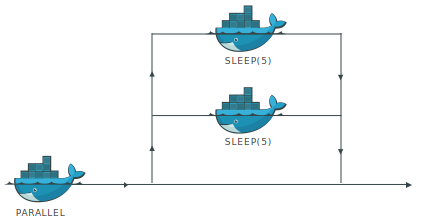

`asyncio` is a library to write concurrent code using the `async / await` syntax. `asyncio` is used as a foundation for multiple Python asynchronous frameworks that provide high-performance network and web-servers, database connection libraries, distributed task queues, etc.

## Asyncio & Cowait

Cowait uses `asyncio` for running concurrent tasks. `asyncio` has a very simple interface to write sequential (blocking) and parallel (non-blocking) operations.

Remember that in Cowait, a call to another task will be intercepted by the Cowait runtime and executed in a separate container — potentially on a different machine.

Before we get into running concurrent tasks, let's look at a very simple example that uses `asyncio` to sleep for 5 seconds.

```python:title=sleep.py
import asyncio
from cowait import task

@task
async def Sleep(duration: int = 5):
    for i in range(duration):
      await asyncio.sleep(1) # blocking
      print("slept", i + 1)

    return {
        "duration": duration,
    }
```

Cowait tasks are defined with the `async` keyword. This allows us to wait for other tasks in an asynchronous fashion, or to use basic features from `asyncio`, like `sleep(n)`. Run the above example:

```shell
cowait run sleep
```

## Parallel Tasks

One of the core features of Cowait is its simple interface to parallelize work on multiple containers. Let's add a new task that spawns multiple `Sleep` tasks in parallel:

```python:title=parallel.py
import asyncio
from cowait import task, join
from sleep import Sleep

@task
async def Parallel():
    tasks = [Sleep(duration=5), Sleep(duration=5)]

    result = await join(tasks)

    return result

```

Here, Cowait provides a utility method `join` to wait for a list of tasks. It is a very simple wrapper for [asyncio.gather()](https://github.com/backtick-se/cowait/blob/master/cowait/tasks/ops.py). Run your new parallel task:

```shell
cowait run parallel
```

The `parallel` task creates two child containers (so 3 in total), that each sleeps for 5 seconds (in parallel). Here's an illustration of the above example:



You will note that the program doesn't run for precisely 5 seconds, and that the `Sleep` containers may start / exit at different times (however `parallel` will block until both are done). This is because there is some overhead in the underlying docker engine to create and spawn new containers for the tasks.
