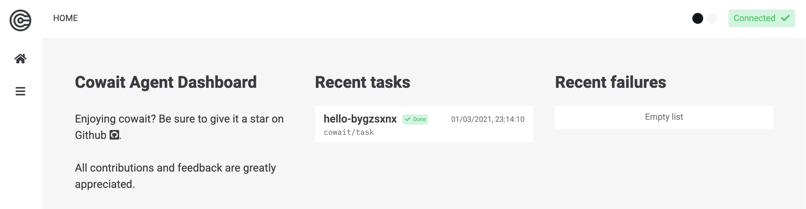
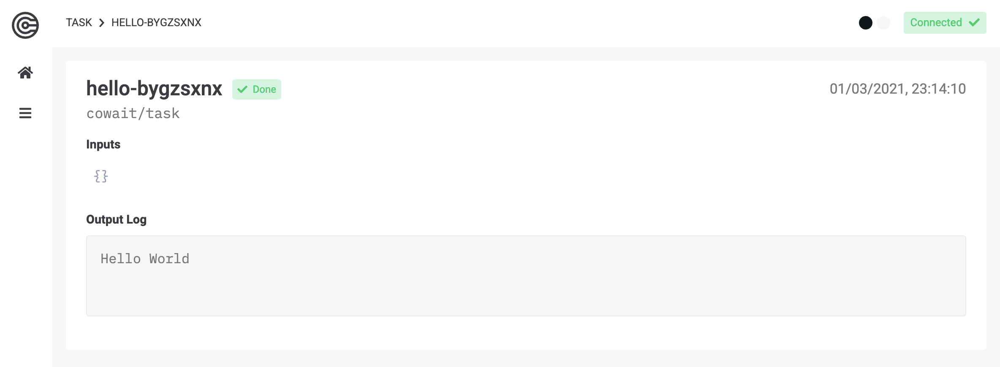

## Cowait Agent

The Cowait Agent is capable of picking up information that happen within Cowait in real time. It hosts a UI that allows you to view and interact with your tasks.

The Agent is actually a Task in itself(!), and runs in a docker container.

You can start it with a simple CLI command:

```shell
cowait agent
```

You should now be able to visit the Cowait UI at [http://localhost:1339](http://localhost:1339)

## Looking at tasks and logs in the Dashboard

If you followed along the previous steps, you should have a project structure like this:

```
my-project/
  ├── sleep.py
  ├── hello.py
  └── parallel.py
```

If you run your `hello` task again after the Cowait agent successfully started, it should show up in the UI:

```shell
cowait run hello
```



The Cowait Agent Dashboard gives you an overview of the tasks you run and their statuses. It also shows you metadata and logs:



## Parallel

Try running your `parallel` task and explore the task hierarchy in the UI!

```shell
cowait run parallel
```
